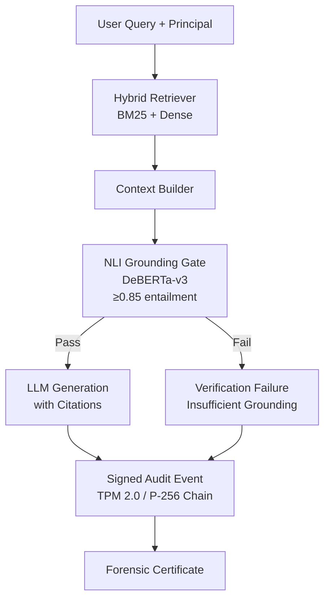
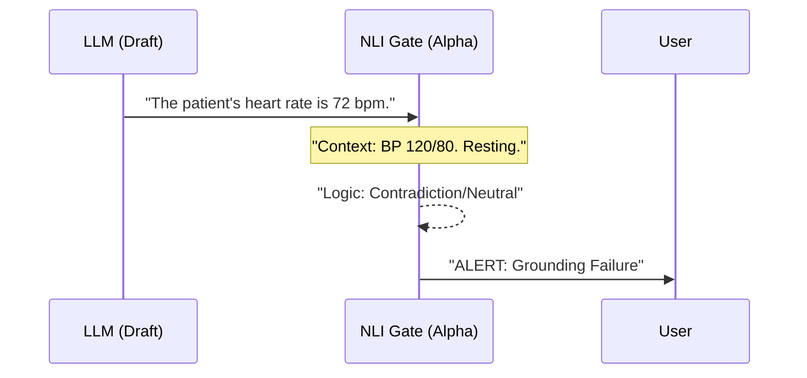

# Sovereign AI Stack (Reference Implementation)

**A Technical Framework for Local-First RAG Verification and Forensic Auditability**

> [!CAUTION]
> **Experimental Research Preview (v0.1.0a2)**
> This repository is a reference implementation for technical exploration. It is **not** currently certified for production use with sensitive data. Last architecture audit: May 2026.

---

## 🔬 Overview

The **Sovereign AI Stack** is an experimental reference implementation for local-first AI governance. It explores a **Verify-First** architecture using **NLI-based Grounding Checks** and **Signed Forensic Audit Trails** to mitigate hallucination and tampering risks in regulated environments.

---

## 🏗️ Technical Architecture

The stack operates as an experimental **Verify-First** pipeline.



Detailed architecture documentation can be found in [docs/ARCHITECTURE.md](docs/ARCHITECTURE.md).

---

## ✨ Key Features (Alpha)

- **NLI Grounding Gate (Experimental)**: Uses a local cross-encoder (`DeBERTa-v3`) to score logical entailment between context and LLM claims. This is a heuristic verification layer, not a formal proof.
- **Forensic Audit Chain (Alpha)**: Every decision event is signed with **Asymmetric Signatures** (P-256 on Windows TPM / Ed25519 in software).
- **ABAC Policy Engine**: Attribute-Based Access Control filters context *before* generation.
- **Compatibility Layer**: Basic OpenAI-compatible gateway via the `sovereign-ai-bridge`.

---

## 🔒 Transparency & Trust Boundaries

| Feature | Research Implementation | Production Hardening Status |
| :--- | :--- | :--- |
| **Grounding** | NLI threshold (DeBERTa-v3) | Experimental |
| **Forensics** | TPM P-256 (Windows) / Keyring (Fallback) | Alpha |
| **Isolation** | Logical (Filesystem + SQL) | Prototype |

> [!NOTE]
> **Hardware Binding**: Support for **TPM 2.0 (P-256)** is currently native on Windows. In MacOS/Linux environments, the stack fallbacks to the OS Keyring. True remote attestation is on the roadmap for Phase 2.

---

## 🛡️ NLI Verification in Action (Conceptual)

The "Airlock" uses a local NLI model to check grounding logic.



---

## 🚀 Quick Start

### 1. Install via Pip
```bash
pip install sovereign-ai-stack
```

### 2. Run the Gateway (OpenAI Compatible)
```bash
python -m sovereign_ai.bridge.main
```

### 3. Explore Examples (Research Preview)
We provide three end-to-end examples in the [examples/](examples/) directory:

| Example | What it demonstrates | Status |
| :--- | :--- | :--- |
| [`01_basic_rag.py`](examples/01_basic_rag.py) | Minimal RAG setup | Stable |
| [`02_verified_query.py`](examples/02_verified_query.py) | NLI Grounding Gate | Experimental |
| [`03_forensic_agent.py`](examples/03_forensic_agent.py) | Signed Audit Chains | Alpha |

---

## 📈 Technical Benchmarks (Alpha)

*Hardware: MacBook Pro M2 Max (32GB) | Model: Qwen-2.5-7B-Instruct (Ollama)*
*Note: These numbers are baseline results and have not yet been validated across diverse hardware or scaled datasets.*

| Operation | Latency (P50) | Verification Rate |
|---|---|---|
| Vector Retrieval | 12ms | N/A |
| Policy Evaluation | 4ms | 100% |
| **NLI Verification (Airlock)** | **82ms** | **~94% (Med-QA Subset)** |
| Cryptographic Signing | 1ms | 100% |

---

## ⚠️ Known Limitations

- **NLI Thresholding**: The default 0.8 threshold may produce false negatives in highly creative writing tasks; it is tuned for *fact-based retrieval*.
- **Hardware Binding**: Support for **TPM 2.0 (P-256)** is now live for Windows environments. MacOS/Linux fallback to OS Keyring (Keychain/DPAPI).
- **Context Window**: Verification latency scales linearly with the number of claims; massive responses (>2048 tokens) may see a lag.

---

## 🛡️ Security Model & Threat Considerations

- **Trust Assumptions**: We assume the host OS (Linux/Windows/macOS) is not compromised at the kernel level.
- **Out of Scope**: This stack does not protect against physical side-channel attacks on the CPU/RAM (yet).
- **Fail-Closed**: If the verification model fails to load or the signature chain is broken, the system **blocks** all output.

---

## 🗺️ Maturation Roadmap

- **Phase 1 (May 2026)**: Monorepo consolidation, TPM 2.0 / Ed25519 forensics, NLI verification.
- **Phase 2 (Q3 2026)**: Secure Enclaves (Intel SGX), Remote Attestation Protocol.
- **Phase 3 (2027)**: Formal verification of the policy engine, Zero-Knowledge Proofs for compliance.

---

## 🤝 Contributing

We value "Brutal Feedback". Please report any architectural bypasses or cryptographic flaws in the Issues section.

---

## 📜 License
MIT
