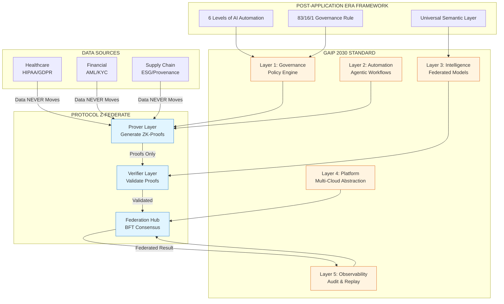

# 🏛️ The Sovereign AI Stack

> **When data proves itself, trust becomes mathematical.**

[](LICENSE)
[](https://github.com/anandkrshnn/sovereign-ai-stack/releases)
[](https://github.com/anandkrshnn/sovereign-ai-stack)
[](https://github.com/anandkrshnn/sovereign-ai-stack/stargazers)

---

## 📖 What Is the Sovereign AI Stack?

The Sovereign AI Stack is a complete, production-ready architecture for enterprises that need to deploy AI across jurisdictional boundaries **without moving sensitive data**.

It combines three open-source frameworks into a unified system:

| Framework | Role | Repository |
|-----------|------|------------|
| **Protocol Z-Federate** | Cryptographic engine (Zero-Knowledge ETL) | [github.com/anandkrshnn/protocol-z-federate](https://github.com/anandkrshnn/protocol-z-federate) |
| **GAIP 2030 Standard** | Operational orchestration & governance | [github.com/anandkrshnn/gaip-2030-standard](https://github.com/anandkrshnn/gaip-2030-standard) |
| **Post-Application Era** | Strategic roadmap & cognitive architecture | [github.com/anandkrshnn/post-application-era](https://github.com/anandkrshnn/post-application-era) |

---

## 🎯 Why Sovereign AI?

| Problem | Traditional Approach | Sovereign AI Solution |
|---------|---------------------|----------------------|
| Data cannot leave jurisdictions (GDPR, HIPAA, DPDP) | Centralize & hope for compliance | **Proofs travel, data stays** |
| Cloud egress fees create vendor lock-in | Pay exponentially to move data | **Compute moves to data** |
| Traditional ETL violates sovereignty laws | Extract raw data → Transform → Load | **ZK-ETL: Prove → Verify → Federate** |
| Audits are reactive and expensive | Post-fact discovery of violations | **Compliance by construction** |

> **"Compute must move to the data."**

---

## 🏗️ Architecture Overview



*Diagram renders natively on GitHub. View source for Mermaid code.*

---

## 🚀 Quick Start

### Clone the Stack

```bash
# Clone all three component repositories
git clone https://github.com/anandkrshnn/protocol-z-federate.git
git clone https://github.com/anandkrshnn/gaip-2030-standard.git
git clone https://github.com/anandkrshnn/post-application-era.git
```

### Run Protocol Z-Federate Demo

```bash
cd protocol-z-federate
pip install -r requirements.txt
python examples/python/age_verification.py
```

**Expected output:**
```text
🔐 Generating proof: Age verification
✅ Proof generated (birthdate hidden, only "18+" proven)
🌐 Cross-region federation: US (HIPAA) + EU (GDPR) + APAC (Local)
🛡️ BFT Consensus reached on federated result
```

### Deploy Sovereign Region (Terraform)

```bash
cd protocol-z-federate/terraform/modules/region
terraform init
terraform apply -var="jurisdiction=EU" -var="compliance=GDPR"
```

---

## 📊 Strategic Adoption Pathway: 6 Levels

| Level | Name | Capability | Timeline | Key Milestone |
|-------|------|------------|----------|---------------|
| **1** | Assisted Intelligence | Single jurisdiction, manual ETL + ZK-proofs | 3-6 months | Zero sovereignty violations in pilot |
| **2** | Augmented Intelligence | Two jurisdictions, semi-automated workflows | 6-9 months | Cross-border fraud detection without data movement |
| **3** | Federated Intelligence | 3+ regions, automated proof generation | 9-12 months | 90% of compliance checks automated |
| **4** | Autonomous Governance | Full GAIP 2030 stack, quantum-resilient | 12-18 months | 83/16/1 rule operational |
| **5** | Sovereign Intelligence | Universal Semantic Layer, self-healing compliance | 18-24 months | Natural language → ZK-proof queries |
| **6** | Autonomous Sovereign AI | Self-governing agents, individual data sovereignty | 24-36 months | Zero data sovereignty incidents |

### The 83/16/1 Governance Rule

| Percentage | Decision Type | Human Involvement | ZK-Proof Requirement |
|------------|---------------|-------------------|----------------------|
| **83%** | Routine, low-risk | None (fully automated) | Proof auto-generated & verified |
| **16%** | Medium-risk, edge cases | Review & approve | Proof presented for validation |
| **1%** | High-risk, novel scenarios | Full human judgment | Proof + reasoning trace + escalation |

---

## 🌍 Real-World Enterprise Adoption

ZK-proof technology is not theoretical — it is in production at the world's largest regulated enterprises.

| Organization | Use Case | Technology | Scale |
|--------------|----------|------------|-------|
| **JPMorgan Chase** | Confidential blockchain transactions | ZK-SNARKs on Quorum | $2B daily |
| **ING Bank** | Mortgage verification (prove salary range without revealing income) | Zero-Knowledge Range Proofs | Production since 2017 |
| **Deutsche Bank** | Cross-border payment validation | ZK-proofs + blockchain | Multi-billion EUR |
| **MIT MedRec** | Patient-controlled health records | ZK-proof access control | Research → Pilot |
| **Circularise** | Plastic supply chain ESG provenance | ZK-proofs for provenance | 16+ countries |

> *The organizations listed are public references illustrating enterprise adoption of zero-knowledge proof technology. They are not customers or endorsers of the Sovereign AI Stack.*

### Regulatory Acceptance

- **White House Crypto Report (2025):** Zero-knowledge proofs highlighted as critical tool for privacy-preserving compliance
- **EU AI Act (2026):** ZK-proofs recognized as valid mechanism for cross-border AI collaboration under GDPR
- **MAS (Singapore), FCA (UK), OCC (US):** Exploring ZK-proof frameworks for regulatory reporting

---

## 💰 Business Value & ROI

| Metric | Achievement | Source |
|--------|-------------|--------|
| **Cloud Egress Fee Reduction** | 60-90% | Multi-cloud enterprises |
| **Compliance Audit Time** | 80% reduction | Healthcare pilots |
| **Fraud Detection Accuracy** | 40-60% improvement | Financial consortia |
| **Cross-Border Collaboration** | 10x faster | Clinical trials |
| **Vendor Lock-in Elimination** | 100% swappable infrastructure | GAIP 2030 deployments |

---

## 🎯 Use Cases by Industry

### Healthcare (HIPAA + GDPR)

| Challenge | Sovereign AI Solution |
|-----------|----------------------|
| Cross-institutional clinical research | Federated learning across hospitals without exposing patient data |
| HIPAA compliance verification | Data never leaves jurisdictional control; proofs verify compliance |
| Cross-border fraud detection | Anomaly detection without moving claims data |
| Epidemiology tracking | Aggregate insights across regions without patient identification |

### Financial Services (AML/KYC + GDPR)

| Challenge | Sovereign AI Solution |
|-----------|----------------------|
| Consortium fraud detection | Banks share fraud intelligence without exposing transaction data |
| AML compliance reporting | Cryptographic transaction trails with audit-ready proofs |
| Cross-border payments | Proofs verify compliance across jurisdictions; data never moves |
| Regulatory examination | Regulators verify proofs without accessing raw data |

### Supply Chain (ESG + Trade Compliance)

| Challenge | Sovereign AI Solution |
|-----------|----------------------|
| Verifiable provenance | Prove origin without exposing trade secrets |
| Counterfeit detection | Cross-competitor collaboration without sharing proprietary data |
| ESG compliance certification | Cryptographic verification of sustainability claims |
| Multi-party trust establishment | Trustless collaboration across supply chain participants |

---

## 📚 Documentation

| Document | Description | Link |
|----------|-------------|------|
| **Whitepaper** | Full technical specification & business case | [Beyond-Data-Gravity-v2.0](https://github.com/anandkrshnn/protocol-z-federate/blob/main/WHITEPAPER.md) |
| **Compliance Mapping** | GDPR/HIPAA/DPDP regulatory requirements mapped to capabilities | [docs/compliance-mapping.md](docs/compliance-mapping.md) |
| **Strategic Adoption** | 6-Level maturity roadmap with timelines | [docs/strategic-adoption.md](docs/strategic-adoption.md) |
| **Technical FAQ** | Common implementation questions | [docs/faq.md](docs/faq.md) |
| **API Reference** | Protocol Z-Federate API documentation | [protocol-z-federate/docs/api.md](https://github.com/anandkrshnn/protocol-z-federate/blob/main/docs/api.md) |

---

## 🧩 Component Repositories

### 🔐 Protocol Z-Federate
**Zero-Knowledge ETL Engine**

```bash
git clone https://github.com/anandkrshnn/protocol-z-federate
```

- ✅ Cross-region federation without data movement
- ✅ ZK-proof generation & verification (Python)
- ✅ BFT consensus for federated results
- ✅ Healthcare, financial, supply chain examples
- **License:** MIT

### ⚙️ GAIP 2030 Standard
**Governance, Automation, Intelligence, Platform**

```bash
git clone https://github.com/anandkrshnn/gaip-2030-standard
```

- ✅ Quantum-resilient policy engine
- ✅ Agentic workflow orchestration
- ✅ GreenOps carbon-aware scheduler
- ✅ Automated reasoning traces for audit
- **License:** MIT

### 🧭 Post-Application Era
**Strategic Framework & Cognitive Roadmap**

```bash
git clone https://github.com/anandkrshnn/post-application-era
```

- ✅ 6 Levels of AI Automation maturity model
- ✅ 83/16/1 governance rule implementation
- ✅ Universal Semantic Layer specification
- ✅ Agent-first enterprise architecture patterns
- **License:** CC BY-NC 4.0

---

## 🤝 Contributing

Contributions welcome! See our [Contribution Guidelines](CONTRIBUTING.md) or open an issue to discuss ideas.

- 🐛 **Report bugs** → [New Issue](https://github.com/anandkrshnn/sovereign-ai-stack/issues/new)
- 💡 **Suggest features** → [Discussions](https://github.com/anandkrshnn/sovereign-ai-stack/discussions)
- 📖 **Improve docs** → Submit a PR
- 🔐 **Security issues** → Email ananda.krishnan@hotmail.com (do not open public issue)

### Development Setup

```bash
# Clone the stack
git clone https://github.com/anandkrshnn/sovereign-ai-stack
cd sovereign-ai-stack

# Install Python dependencies (for examples)
pip install -r protocol-z-federate/requirements.txt

# Run tests
pytest protocol-z-federate/tests/
```

---

## 🗓️ Roadmap

### Q2 2026
- [ ] Quantum-resistant proof schemas (CRYSTALS-Dilithium integration)
- [ ] Integration with Snowflake/Databricks connectors
- [ ] Regulatory sandbox partnerships (EU, Singapore)

### Q3 2026
- [ ] Self-sovereign identity wallets for individual data control
- [ ] Cross-industry proof standards working group
- [ ] GreenOps carbon optimization v2 with real-time pricing

### Q4 2026
- [ ] Autonomous compliance negotiation between jurisdictions
- [ ] Federated learning marketplace for proof-based model training
- [ ] Sovereign AI Stack certification program

---

## 📄 License

| Framework | License |
|-----------|---------|
| Protocol Z-Federate | [MIT](https://opensource.org/licenses/MIT) |
| GAIP 2030 Standard | [MIT](https://opensource.org/licenses/MIT) |
| Post-Application Era | [CC BY-NC 4.0](https://creativecommons.org/licenses/by-nc/4.0/) |
| **Sovereign AI Stack (this repo)** | [MIT](LICENSE) |

---

## 👨‍💻 About the Author

**Anandakrishnan Damodaran**  
*Principal Data Scientist | Sovereign AI Architect*

- Creator of Protocol Z-Federate, GAIP 2030, and the 6 Levels of AI Automation
- Lead developer of Zero-Knowledge ETL (ZK-ETL) for cross-jurisdictional intelligence
- 17+ years architecting petabyte-scale AI platforms for global enterprises
- 12+ cloud certifications (Google Cloud Professional, AWS, Azure, Tableau, Power BI)

**Contact:**  
📧 [ananda.krishnan@hotmail.com](mailto:ananda.krishnan@hotmail.com)  
🔗 [linkedin.com/in/anandkrshnn](https://linkedin.com/in/anandkrshnn)  
🐙 [github.com/anandkrshnn](https://github.com/anandkrshnn)

---

## ⭐ Star the Repositories

If you find the Sovereign AI Stack valuable, please star the repositories:

- [🏛️ sovereign-ai-stack](https://github.com/anandkrshnn/sovereign-ai-stack) ← You are here
- [🔐 protocol-z-federate](https://github.com/anandkrshnn/protocol-z-federate)
- [⚙️ gaip-2030-standard](https://github.com/anandkrshnn/gaip-2030-standard)
- [🧭 post-application-era](https://github.com/anandkrshnn/post-application-era)

---

> *"The future of AI is not centralized—it's sovereign, federated, and cryptographically verifiable. When data proves itself, trust becomes mathematical."*

---

## 📬 Citation

If you use this work in research or publications, please cite:

```bibtex
@techreport{damodaran2026sovereignai,
  title={Beyond Data Gravity: Zero-Knowledge ETL \& The Sovereign AI Stack},
  author={Damodaran, Anandakrishnan},
  year={2026},
  version={2.0},
  institution={GitHub},
  url={https://github.com/anandkrshnn/sovereign-ai-stack},
  license={MIT / CC BY-NC 4.0}
}
```

---

*Last updated: March 2026 • Version 2.0*
