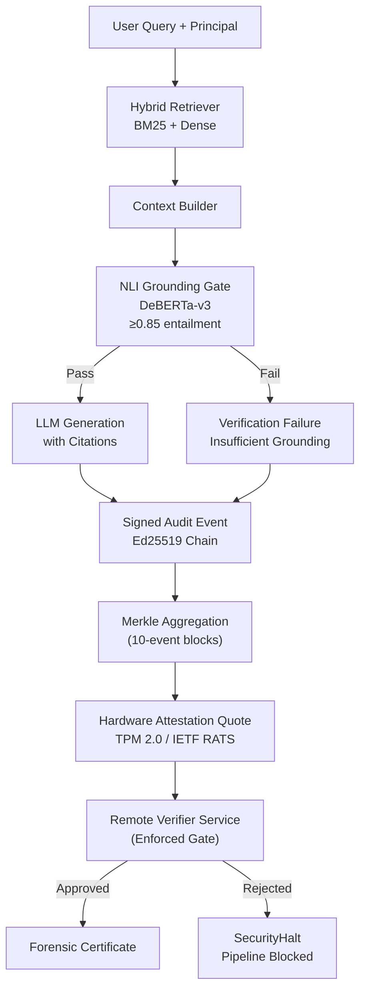
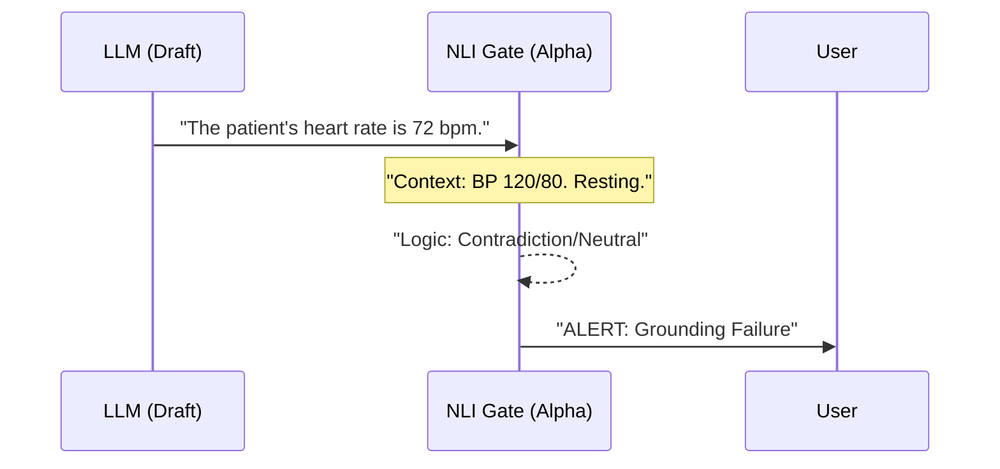

# Sovereign AI Stack (Reference Implementation)

**A Technical Framework for Local-First RAG Verification and Forensic Auditability**

> [!CAUTION]
> **Experimental Research Preview (v0.1.0a5)**
> This repository is a reference implementation for technical exploration. It is **not** currently certified for production use with sensitive data. Last architecture audit: May 2026.

---

## 🔬 Overview

The **Sovereign AI Stack** is an experimental reference implementation for local-first AI governance. It explores a **Verify-First** architecture using **NLI-based Grounding Checks** and **Signed Forensic Audit Trails** to mitigate hallucination and tampering risks in regulated environments.

---

## 🏗️ Technical Architecture

The stack operates as an experimental **Verify-First** pipeline.



Detailed architecture documentation, including C4 Container Diagrams and Architecture Decision Records (ADRs), can be found in [docs/architecture/c4-container-v0.1.0a5.md](docs/architecture/c4-container-v0.1.0a5.md).

For an honest assessment of current technical debt and discrepancies, see [docs/architecture/KNOWN_GAPS.md](docs/architecture/KNOWN_GAPS.md).

---

## ✨ Key Features (Alpha)

- **NLI Grounding Gate (Experimental)**: Uses a local cross-encoder (`DeBERTa-v3`) with **batched inference** (~90ms latency) to score logical entailment between context and LLM claims.
- **Mandatory Attestation Gate (v0.1.0a5)**: The pipeline can be configured to **fail-closed** unless a Remote Verifier approves the platform's hardware state.
- **Hardware-Attested Forensics (Alpha)**: Every decision event is signed and aggregated into Merkle Trees, with roots bound to **Native TPM 2.0 Hardware Quotes** (Linux ESYS).
- **ABAC Policy Engine**: Attribute-Based Access Control filters context *before* generation.
- **Compatibility Layer**: Basic OpenAI-compatible gateway via the `sovereign-ai-bridge`.

---

## 🔒 Transparency & Trust Boundaries

| Feature | Research Implementation | Production Hardening Status |
| :--- | :--- | :--- |
| **Grounding** | NLI threshold (DeBERTa-v3) | Experimental |
| **Forensics** | TPM 2.0 / IETF RATS (Linux Native) | Alpha |
| **Isolation** | Logical (Filesystem + SQL) | Prototype |

> [!IMPORTANT]
> **Hardware-Anchored Trust**: v0.1.0a4 introduces the **Hardware Abstraction Layer (HAL)**. It supports native **TPM 2.0 (ESYS)** on Linux for remote attestation, with structural support for Windows and a high-fidelity simulator for development.

---

## 🔒 Mandatory Attestation Gate (v0.1.0a5)

The Sovereign AI Stack introduces a **Mandatory Verification Gate** to ensure that AI operations only occur on trusted, untampered hardware.

1.  **Challenge-Response**: Upon initialization, the pipeline generates a fresh hardware quote (Evidence) bound to a random nonce.
2.  **Remote Verification**: This evidence is sent to a **Remote Verifier Service**.
3.  **Enforcement**: If the verifier rejects the quote (e.g., PCR mismatch, stale firmware, or invalid signature), the pipeline raises a `SecurityHalt` and terminates immediately.
4.  **Fail-Closed**: This prevents "Ghost Nodes" or compromised instances from joining the sovereign network.

---

## 🛡️ Hardware-Attested Audit Chain

## 🛡️ NLI Verification in Action (Conceptual)

The "Airlock" uses a local NLI model to check grounding logic.



---

## 🚀 Quick Start

### 1. Install via Pip
```bash
pip install sovereign-ai-stack
```

### 2. Run the Gateway (OpenAI Compatible)
```bash
python -m sovereign_ai.bridge.main
```

### 3. Explore Examples (Research Preview)
We provide three end-to-end examples in the [examples/](examples/) directory:

| Example | What it demonstrates | Status |
| :--- | :--- | :--- |
| [`01_basic_rag.py`](examples/01_basic_rag.py) | Minimal RAG setup | Stable |
| [`02_verified_query.py`](examples/02_verified_query.py) | NLI Grounding Gate | Experimental |
| [`03_forensic_agent.py`](examples/03_forensic_agent.py) | Signed Audit Chains | Alpha |

---

## 📈 Technical Benchmarks (Alpha)

*Hardware: MacBook Pro M2 Max (32GB) | Model: Qwen-2.5-7B-Instruct (Ollama)*
*Note: These numbers are baseline results and have not yet been validated across diverse hardware or scaled datasets.*

| Operation | Latency (P50) | Verification Rate |
|---|---|---|
| Vector Retrieval | 12ms | N/A |
| Policy Evaluation | 4ms | 100% |
| **NLI Verification (Airlock)** | **82ms** | **~94% (Med-QA Subset)** |
| Cryptographic Signing | 1ms | 100% |

---

## ⚠️ Known Limitations

- **NLI Thresholding**: The default 0.8 threshold may produce false negatives in highly creative writing tasks; it is tuned for *fact-based retrieval*.
- **Hardware Binding**: Support for **TPM 2.0** is now live via the pluggable HAL. Native ESYS support is available for Linux; Windows and macOS fall back to software-bound simulator keys unless configured otherwise.
- **Context Window**: Verification latency scales linearly with the number of claims; massive responses (>2048 tokens) may see a lag.

---

## 🛡️ Security Model & Threat Considerations

- **Trust Assumptions**: We assume the host OS (Linux/Windows/macOS) is not compromised at the kernel level.
- **Out of Scope**: This stack does not protect against physical side-channel attacks on the CPU/RAM (yet).
- **Fail-Closed**: If the verification model fails to load or the signature chain is broken, the system **blocks** all output.

---

## 🗺️ Target Maturation Roadmap

For detailed technical requirements to reach production readiness, see [Maturation Gates](docs/architecture/MATURATION_GATES.md).

- **Phase 1 (Completed)**: Monorepo consolidation, Forensic Hardening (Merkle/STRIDE), Remote Trust Preview (RATS), Pluggable Hardware Abstraction Layer (HAL).
- **Phase 2 (Completed)**: Hardware-Anchored Merkle Checkpoints, Linux TPM 2.0 Native Integration (ESYS).
- **Phase 3 (2026/2027)**: Secure Enclaves (Intel SGX), ZK-Proofs for compliance, Knowledge-Augmented Gates (K-Gate).

---

## 🤝 Contributing

We value "Brutal Feedback". Please report any architectural bypasses or cryptographic flaws in the Issues section.

---

## 📜 License
MIT
