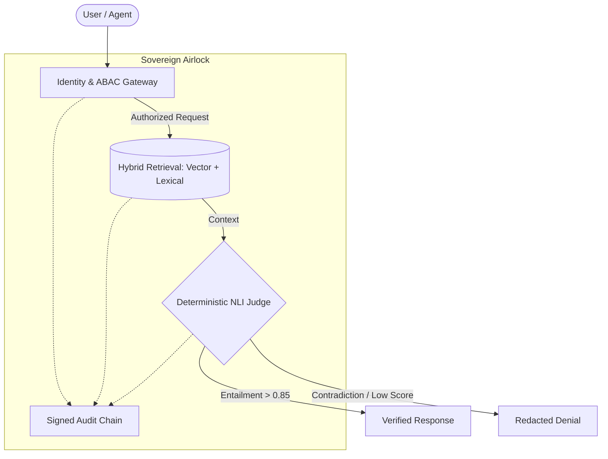

# 🛡️ Sovereign AI Stack (v0.1.0-preview · Reference Implementation)

[](https://pypi.org/project/sovereign-ai-stack/)
[](https://github.com/anandkrshnn/sovereign-ai-stack/actions/workflows/ci.yml)
[](https://github.com/anandkrshnn/sovereign-ai-stack/releases/tag/v0.1.0-preview)
[](https://www.ietf.org/archive/id/draft-anandakrishnan-rats-ptv-agent-identity-00.html)
[](https://opensource.org/licenses/MIT)

> **A local-first RAG and policy-gating scaffold for AI systems that need auditability — no cloud required.**

> [!NOTE]
> **This project is a reference implementation and alpha preview (`0.1.0a1` on PyPI / `v0.1.0-preview` on GitHub).**
> We have recently completed a technical hardening cycle to align the codebase with its architectural claims. 
> The fragile generative judge has been replaced with a **deterministic NLI classifier**, and audit logs are now **digitally signed**.

---

### ⚡ First Look

| **What is it?** | **What works today?** | **What's next?** |
| :--- | :--- | :--- |
| A local-first reference scaffold for policy-gated, auditable RAG pipelines. No cloud, no telemetry. | **Hybrid RAG**, **ABAC Gating**, **NLI Grounding Judge**, **Signed Audit Chain (Ed25519)**. | Hardware attestation (TPM binding), full CI/CD performance baselines. See [ROADMAP.md](ROADMAP.md). |

---

## Current Status (v0.1.0-preview)

**Implemented and running:**
- [x] **Verified Airlock**: Mandatory **NLI Grounding Judge** (`cross-encoder/nli-deberta-v3-base`) blocks hallucinations with deterministic scores.
- [x] **Signed Audit Chain**: Every event is hashed (SHA-256) and signed with **Ed25519 asymmetric signatures** stored in OS-backed secure storage.
- [x] **Hybrid Retrieval**: SQLite FTS5 + LanceDB vector store fusion + BGE reranker.
- [x] **ABAC Gateway**: Identity-aware policy enforcement before retrieval.
- [x] **OpenAI Bridge**: Drop-in `/v1/chat/completions` compatibility.
- [x] **CLI + Docker**: `sovereign` CLI and `docker-compose` deployment.

**In progress / roadmap:**
- [ ] **Hardware-Bound Signing**: Moving from OS secure storage to true non-exportable TPM/Enclave-backed signing.
- [ ] **CI Performance Baselines**: Automated `benchmark.py` integration for every commit.
- [ ] **Compliance Certification**: External audit for HIPAA / SOC 2 readiness.

---


*(Above: The Verified Airlock in action — redacting ungrounded responses in real-time using deterministic NLI scores)*

---

## 🏗️ The Stack Architecture: "The Verified Airlock"

Unlike fragmented tools, the Sovereign AI Stack integrates security at the architectural level. Every request follows a mandatory "Trinity of Trust" workflow:



1.  **Retrieve (Knowledge)**: Hybrid vector-lexical retrieval from local vaults.
2.  **Govern (Gateway)**: Identity-aware ABAC gates every retrieval.
3.  **Verify (Integrity)**: A **deterministic NLI Cross-Encoder** scores every answer against the evidence.
4.  **Prove (Forensics)**: Every component signs events to a **Unified Forensic Chain** (Ed25519 signed, SHA-256 linked), anchored to OS-backed secure storage.

---

## 📜 Component Maturity

| Component | Status | Role |
| :--- | :--- | :--- |
| **`sovereign-ai[rag]`** | `Alpha` | **Governed Knowledge**: Multi-tenant RAG with air-gapped retrieval. |
| **`sovereign-ai[verify]`** | `Alpha` | **The Judge**: Deterministic NLI verification for grounding proof. |
| **`sovereign-ai[bridge]`** | `Alpha` | **The Airlock**: OpenAI-compatible gateway with unified identity sync. |
| **`sovereign-ai[agent]`** | `Alpha` | **Forensic Execution**: Tool-use with signed audit trails. |

---

## ⚡ Quickstart

### 1. Installation
```bash
pip install sovereign-ai-stack[full]
```

### 2. The 60-Second "Airlock" Proof
Run a verified query that passes through the **NLI grounding gate**:
```bash
sovereign ask "What is the hypertension protocol?" --principal doctor --verify
```
*If the answer is not grounded (hallucination), the Airlock will redact it with `[Sovereign Access Denied]`.*

### 3. Unified Audit Inspection
Check the cryptographic integrity of your forensic trail:
```bash
sovereign audit verify --tenant default
```

---

## 🛡️ Capabilities

| Capability | Status | Notes |
| :--- | :--- | :--- |
| **Local Execution** | ✅ Implemented | 100% on-device, no telemetry |
| **Hybrid Retrieval** | ✅ Implemented | SQLite FTS5 + LanceDB + BGE reranker |
| **ABAC Policy Gateway** | ✅ Implemented | Role-based access control before retrieval |
| **Grounding Judge** | ✅ Implemented | **NLI Cross-Encoder** (DeBERTa-v3); not a generative proxy |
| **Signed Audit Chain** | ✅ Implemented | **Ed25519 signatures**; OS-backed secure key storage |
| **OpenAI Bridge** | ✅ Implemented | `/v1/chat/completions` drop-in |
| **Hardware Binding** | 🔧 Roadmap | TPM / Secure Enclave integration (Target: Q3 2026) |

---

## 📊 Performance & Reproducibility

> **Methodology**: Use [`benchmark.py`](benchmark.py) to generate latency numbers on your hardware. 

- **Airlock Latency (NLI Judge)**: ~50-100ms (CPU-optimized DeBERTa-v3)
- **ABAC Gate Latency**: ~5ms 
- **Forensic Signing**: <10ms per event (Ed25519)
- **Privacy**: 100% offline; no cloud dependencies.

---

## 🔗 Public Proofs & Standards

- 📜 **IETF Draft**: [PTV Agent Identity](https://www.ietf.org/archive/id/draft-anandakrishnan-rats-ptv-agent-identity-00.html)
- 🏛️ **Affiliations**: [Anandakrishnan Damodaran](https://github.com/anandkrshnn)
- 🗺️ [Roadmap](ROADMAP.md)

---

© 2026 [Anandakrishnan Damodaran](https://github.com/anandkrshnn) — Personal R&D project  
🛰️ *Sovereignty is the new safety.*
