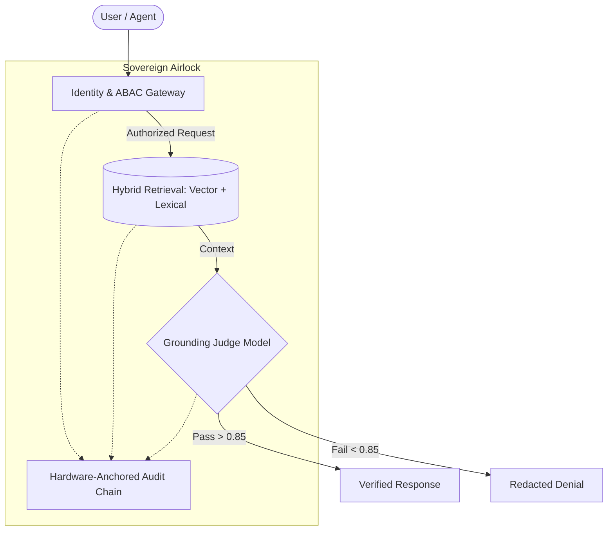

# 🛡️ Sovereign AI Stack (v0.1.0-preview · Reference Implementation)

[](https://pypi.org/project/sovereign-ai-stack/)
[](https://github.com/anandkrshnn/sovereign-ai-stack/actions/workflows/ci.yml)
[](https://github.com/anandkrshnn/sovereign-ai-stack/releases/tag/v0.1.0-preview)
[](https://www.ietf.org/archive/id/draft-anandakrishnan-rats-ptv-agent-identity-00.html)
[](https://opensource.org/licenses/MIT)

> **A local-first RAG and policy-gating scaffold for AI systems that need auditability — no cloud required.**

> [!NOTE]
> **This project is a reference implementation and alpha preview (`0.1.0a1` on PyPI / `v0.1.0-preview` on GitHub).**
> Earlier release naming suggested a higher maturity level than the codebase currently supports.
> Versioning and documentation have been updated to better reflect the current state.

---

### ⚡ First Look

| **What is it?** | **What works today?** | **What's next?** |
| :--- | :--- | :--- |
| A local-first reference scaffold for policy-gated, auditable RAG pipelines. No cloud, no telemetry. | Hybrid retrieval (SQLite FTS5 + LanceDB), ABAC identity gating, SHA-256 audit logging, OpenAI-compatible bridge. | Signed audit chains, a real grounding judge, adversarial blocking tests. See [ROADMAP.md](ROADMAP.md). |

---

---

## Current Status (v0.1.0-preview)

**Implemented and running:**
- [x] **Hybrid Retrieval**: SQLite FTS5 + LanceDB vector store fusion
- [x] **ABAC Gateway**: Identity-aware policy enforcement before retrieval
- [x] **Audit Logging**: SHA-256-linked event chain (JSONL + SQLite)
- [x] **OpenAI Bridge**: Drop-in `/v1/chat/completions` compatibility
- [x] **CLI + Docker**: `sovereign` CLI and `docker-compose` deployment

**In progress / roadmap:**
- [ ] **Grounding Judge**: Real hallucination detection (current: reranker score proxy)
- [ ] **Signed Audit Chain**: Cryptographic signing for non-repudiation
- [ ] **Hardware Attestation**: TPM / Secure Enclave integration
- [ ] **Compliance Certification**: HIPAA / SOC 2 external audit

---


*(Above: The Verified Airlock in action — redacting ungrounded responses in real-time)*

---

## 🏗️ The Stack Architecture: "The Verified Airlock"

Unlike fragmented tools, the Sovereign AI Stack integrates security at the architectural level. Every request follows a mandatory "Trinity of Trust" workflow:



1.  **Retrieve (Knowledge)**: Hybrid vector-lexical retrieval from local, encrypted SQLCipher3 vaults.
2.  **Govern (Gateway)**: Identity-aware ABAC (Attribute-Based Access Control) gates every retrieval.
3.  **Verify (Integrity)**: A mandatory local judge model scores every answer for grounding and faithfulness.
4.  **Prove (Forensics)**: Every component logs to a **Unified Forensic Audit Chain** (SHA-256 linked), providing tamper-evident proof of compliance.

---

## 📜 Version History

**v0.1.0-preview** (2026-04-27) — First public release

This is the initial public release of a personal R&D project exploring local-first RAG, policy gating, and audit-friendly logging for AI pipelines.

**Implemented and running:**
- Hybrid retrieval: SQLite FTS5 + LanceDB
- ABAC gateway: identity-aware access control
- Audit logging: SHA-256 hashed event chain (JSONL + SQLite)
- OpenAI-compatible bridge (`/v1/chat/completions`)
- CLI + Docker deployment

**In progress / roadmap:**
- Cryptographically signed (non-repudiable) audit chains
- Production-grade grounding judge with adversarial test coverage
- Hardware attestation (TPM / Secure Enclave)
- External compliance certification (HIPAA, SOC 2)

See [ROADMAP.md](ROADMAP.md) for the full plan.

---

| Component | Status | Role |
| :--- | :--- | :--- |
| **`sovereign-ai[rag]`** | `GA` | **Governed Knowledge**: Multi-tenant RAG with air-gapped retrieval. |
| **`sovereign-ai[verify]`** | `GA` | **The Judge**: Mandatory verification gate for grounding proof. |
| **`sovereign-ai[bridge]`** | `GA` | **The Airlock**: OpenAI-compatible gateway with unified identity sync. |
| **`sovereign-ai[agent]`** | `GA` | **Forensic Execution**: Tool-use with immutable audit trails. |

---

## ⚡ Quickstart

### 1. Installation
Install the complete stack with all enterprise features:
```bash
pip install sovereign-ai-stack[full]
```

### 2. The 60-Second "Airlock" Proof
Run a verified query that passes through the grounding gate:
```bash
sovereign ask "What is the hypertension protocol?" --principal doctor --verify
```
*If the answer is not grounded in your local data, the Airlock will redact it with `[Sovereign Access Denied]`.*

### 3. One-Command Production Deployment
Deploy the full stack (Bridge + Local LLM + Prometheus + Jaeger) using Docker:
```bash
docker-compose up -d
```
*This launches a complete sovereign environment with built-in observability.*

### 4. Unified Audit Inspection
Every request creates a cryptographically linked chain of events:
```bash
# Check the forensic integrity of your tenant's audit trail
sovereign audit verify --tenant default
```

---

## 🛡️ Capabilities

| Capability | Status | Notes |
| :--- | :--- | :--- |
| **Local Execution** | ✅ Implemented | 100% on-device, no telemetry |
| **Hybrid Retrieval** | ✅ Implemented | SQLite FTS5 + LanceDB + BGE reranker |
| **ABAC Policy Gateway** | ✅ Implemented | Role-based access control before retrieval |
| **Audit Logging** | ✅ Implemented | SHA-256-linked JSONL + SQLite; append-only |
| **OpenAI-Compatible Bridge** | ✅ Implemented | `/v1/chat/completions` drop-in |
| **Grounding Judge** | 🔧 Roadmap | Currently: reranker score proxy, not a true hallucination detector |
| **Signed Audit Chain** | 🔧 Roadmap | Hashing is present; cryptographic signing is not |
| **Hardware Attestation** | 🔧 Roadmap | TPM / Secure Enclave integration not yet implemented |
| **Compliance Certification** | 🔧 Roadmap | Designed to support HIPAA/SOC2 patterns; no external audit |

---

## 📊 Performance & Status

- **ABAC Gate Latency**: ~5ms on localhost (single-node, development setup)
- **Forensic Hashing**: <50ms per event on commodity hardware
- **Privacy**: No telemetry, no cloud dependencies, 100% offline
- **Compliance**: *Designed* to support HIPAA Technical Safeguard patterns and SOC 2 audit log requirements — not independently certified

> Benchmarks are from a local development environment. Production results will vary by hardware, load, and model size.

---

## 🔗 Public Proofs & Standards

- 📜 **IETF Draft**: [PTV Agent Identity (draft-anandakrishnan-rats-ptv-agent-identity)](https://www.ietf.org/archive/id/draft-anandakrishnan-rats-ptv-agent-identity-00.html)
- 💬 **Community Discussion**: [Hacker News Thread (47920787)](https://news.ycombinator.com/item?id=47920787)
- 🏛️ **Affiliations**: Referenced via [github.com/anandkrshnn](https://github.com/anandkrshnn)
- 📖 [Documentation & FAQs](docs/FAQ.md)
- ⚖️ [Compliance Framework (COMMERCIAL.md)](COMMERCIAL.md)
- 🗺️ [Roadmap & GAIP-2030](ROADMAP.md)

---

## 📜 Licensing & Standards

- **License**: MIT License
- **Standards**: Aligned with NIST AI RMF, ISO/IEC 42001, and GAIP-2030 protocols.

---

## ✅ Status

**v0.1.0-preview — Reference Implementation. Not production-certified.**

- **Test Coverage**: Core retrieval and ABAC gating pipeline. Adversarial and chaos tests are in progress — see [ROADMAP.md](ROADMAP.md).
- **Grounding**: Uses BAAI/bge-reranker-base scores as a proxy signal. A dedicated grounding judge is a roadmap item.
- **Audit Chain**: SHA-256 event hashing is implemented. Cryptographic signing is not yet implemented.

---
© 2026 [Anandakrishnan Damodaran](https://github.com/anandkrshnn) — Personal R&D project
🛰️ *Sovereignty is the new safety.*
