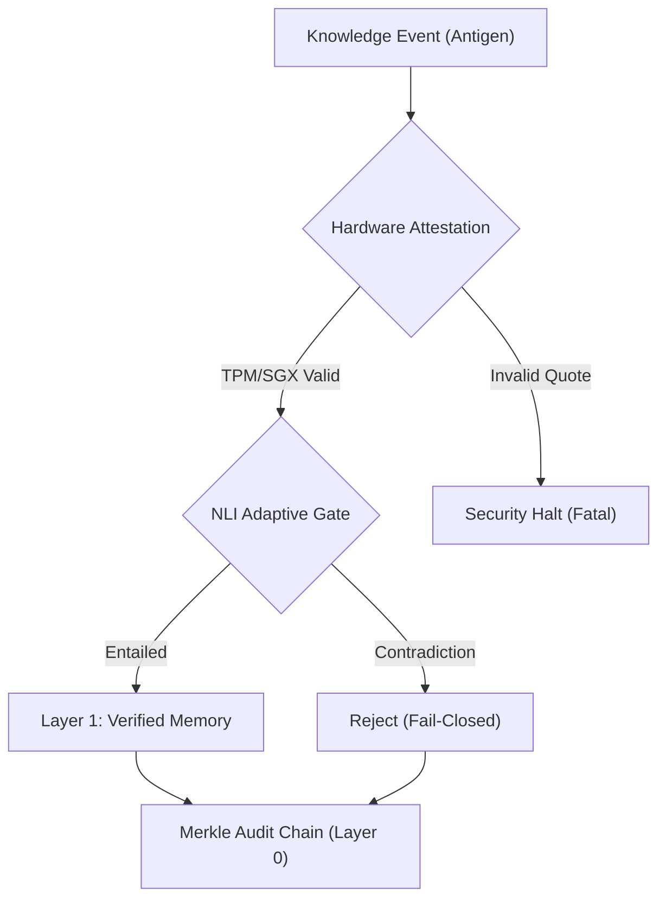

# Sovereign AI Stack

**The Verified Airlock for Sovereign AI.**

[](LICENSE)
[]()
[]()
[](https://github.com/anandkrshnn/sovereign-ai-stack/actions/workflows/ci.yml)
[](https://github.com/anandkrshnn/sovereign-ai-stack/actions/workflows/security.yml)
[]()

> *"Every enterprise will build AI. The question is whether they will build it with mathematical proof, or ship a black-box demo that fails compliance in production."*

## 🛡️ The End of Security Theater

The Sovereign AI Stack is a **Reference Architecture** designed for one purpose: forcing generative AI into a deterministic, cryptographically verifiable compliance boundary. It is built for highly regulated environments (Finance, Healthcare, Defense) adhering to zero-trust networks and impending standards like GAIP-2030 and EU AI Act strictures.

We do not build wrappers around APIs. We build **Airlocks**. 

If a generation fails grounding logic, it drops. If an audit log cannot produce an O(1) Merkle inclusion proof, the system halts. If the underlying hardware fails TPM 2.0 attestation, the network refuses to boot.

**Fail-Closed is the only acceptable state.**

---

## 🏗️ Architectural Authority

The stack operates via a strict **Verify-First** pipeline. It bridges generative freedom with innate system immunity.


```mermaid
flowchart TD
    A["Knowledge Event (Antigen)"] --> B{"Hardware Attestation"}
    B -->|TPM/SGX Valid| C{"NLI Adaptive Gate"}
    B -->|Invalid Quote| X["Security Halt (Fatal)"]
    C -->|Entailed| D["Layer 1: Verified Memory"]
    C -->|Contradiction| E["Reject (Fail-Closed)"]
    D --> G["Merkle Audit Chain (Layer 0)"]
    E --> G
```

### The Three Pillars of v2.0

1. **NLI Grounding Gate**: Uses a local DeBERTa-v3 cross-encoder to enforce logical entailment between the trusted context and the LLM claim. It uses Platt Scaling for brutal confidence thresholds (>=0.85). It is immune to basic syntactic mimicry.
2. **Forensic Audit Chain**: An append-only log anchored in Ed25519 asymmetric cryptography. Events are aggregated into `MERKLE_CHECKPOINT` blocks, ensuring O(1) file-seek inclusion proofs for any historical event.
3. **Hardware-Anchored Trust**: Keys are not stored in memory. They are sealed to Native TPM 2.0 (ESYS) PCR states. Remote verifiers explicitly challenge the enclave before enabling the gateway.

---

## 🚀 One-Command Quickstart

### Try the PTV Airlock Live (Browser Demo)

[]()

Watch hardware attestation, NLI rejection of hallucinations, and tamper-proof Merkle verification in real time via an interactive Web UI.

```bash
# 1. Install via pip with demo dependencies
pip install -e .[demo]

# 2. Run the PTV Web UI
python -m examples.ptv_web_ui
```

### Or use the CLI Demo
```bash
python -m examples.ptv_live_demo
```

### Start the Local AI Gateway
```bash
python -m sovereign_ai.bridge.main
```
---

## ⚖️ Competitor Differentiation

Why choose Sovereign AI Stack over generic orchestration frameworks (LangChain, LlamaIndex) or enterprise RAG-as-a-Service platforms?

| Feature | Sovereign AI Stack | Generic Frameworks | Enterprise SaaS |
| :--- | :--- | :--- | :--- |
| **Grounding Verification** | Deterministic NLI Cross-Encoder | Prompt-based "Self-Correction" | Black-box proprietary scoring |
| **Forensic Auditability** | Merkle Chain + Cryptographic Proofs | Basic app-level JSON logging | Cloud provider logs |
| **Trust Anchor** | TPM 2.0 / Hardware Secure Enclave | OS-level secrets / `.env` files | Cloud KMS |
| **Failure Mode** | Strict Fail-Closed | Fail-Open / Hallucination | Silent fallback |

---

## 🤝 The Contributor Standard

We are building a community of cryptographers, distributed systems engineers, and pragmatic ML researchers. We have zero tolerance for bloated frameworks or hype-driven development.

If you want to contribute, review our [Contributor Onboarding Guide](docs/CONTRIBUTOR_ONBOARDING_v2.0.md) and pick an issue from the [v2.0 Milestone Tracker](announcements.md). We demand:
- **Brutal Minimalism**: No over-engineering.
- **Defensive Design**: Write tests for the adversarial edge case, not the happy path.
- **Mathematical Honesty**: Do not claim statistical probabilities are deterministic proofs.

---

## 🔒 Bulletproof Security & Limitations

We publish our weaknesses as prominently as our features. Read the [LIMITATIONS.md](LIMITATIONS.md) before deploying.
If you discover a vulnerability, please do NOT open a public issue. Email `ananda.krishnan@hotmail.com` directly.

## 📜 License
MIT
