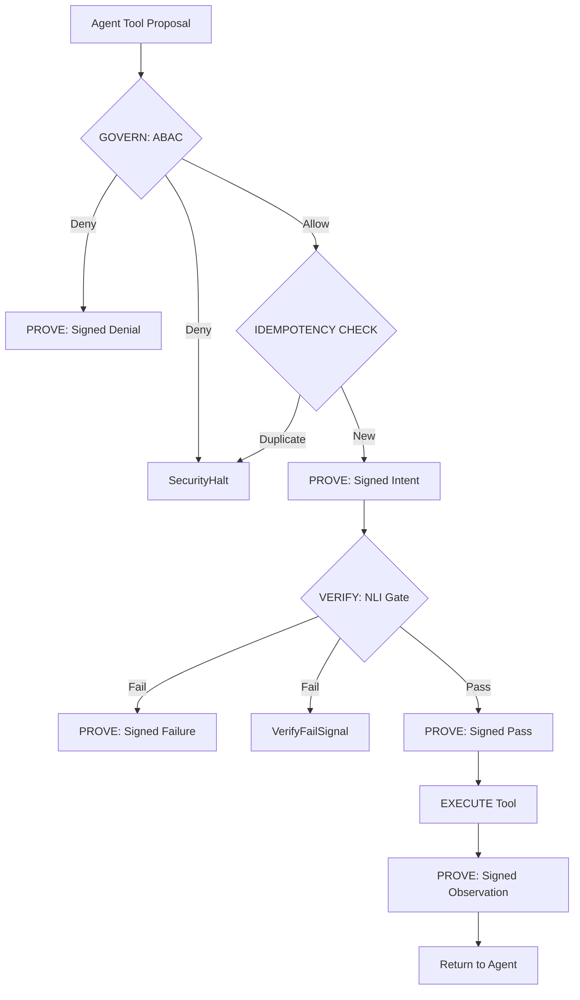

# Sovereign AI: Agent Architecture & Orchestration

This document specifies the architecture for the `SovereignAgent` orchestrator, a "Fail-Closed" reasoning loop integrated into the Sovereign AI Stack.

## 1. Understanding Summary

*   **What:** A secure, interceptor-based agent reasoning loop.
*   **Why:** To enable agent autonomy while maintaining absolute security boundaries (ABAC) and cryptographic auditability (Ed25519).
*   **Who:** Regulated enterprise, B2B, and high-trust environments.
*   **Key Constraints:** <100ms internal latency, bounded self-correction, hard-halt circuit breakers.
*   **Non-Goals:** Unbounded retry loops; proceeding after verification failure (UX-first).

## 2. Decision Log

| Decision | Chosen Path | Rationale |
| :--- | :--- | :--- |
| **Pattern** | **Interceptor Middleware** | Infrastructure-level enforcement; low latency; model-agnostic. |
| **Policy** | **Bounded Recovery (Fail-Closed)** | Allows recovery from reasoning mistakes while maintaining a hard security boundary. |
| **State** | **External `AgentState`** | Prevents session bleed and prompt corruption. |
| **Signals** | **Typed Out-of-Band Signals** | Eliminates prose injection as an attack vector for failures. |
| **Forensics** | **Stamp-First (Intent -> Obs)** | Guarantees mid-execution visibility and tamper-evident sequential chains. |
| **Safety** | **Idempotency Keys** | Prevents double-execution of side-effectful tools. |
| **Reliability** | **`asyncio.shield` Audit Writes** | Ensures forensic chain integrity during task cancellation. |

## 3. The Trinity Integration (Middleware Chain)

The orchestrator gates every tool call through the following sequential pipeline:

## 4. Key Components

### 4.1 `AgentState` (External Session Object)
Maintained outside the LLM context to track execution metadata:
* `session_id`: Unique trace for the entire task.
* `action_id`: Unique ID for the current step.
* `retry_count`: Incremented on `VerifyFailSignal`.
* `principal`: User/Agent identity attributes for ABAC.

### 4.2 `VerifyFailSignal` (Typed Exception)
Carries the `signed_failure_hash` to anchor the signal to the forensic chain, preventing spoofed failures.

### 4.3 `SecureInterceptor`
The core engine executing the middleware chain. It uses the `AuditChainManager` for all `PROVE` steps, ensuring every record includes `prev_hash` and `sequence_number`.

## 5. Security Policies

*   **Recoverable Failures:** 1–2 retries allowed with a typed `VERIFY_FAIL` signal injected into a minimal, templated prompt addendum.
*   **High-Risk Actions:** Irreversible, state-modifying, or privacy-sensitive actions trigger an immediate `SecurityHalt` upon any failure or for any `CONFIRM` result.
*   **Signing Grain:** Action trace (Intent, Verification, Observation) is signed. Internal reasoning (Chain-of-Thought) remains private to the session.

---
**Status:** Validated Design (v1.0)
