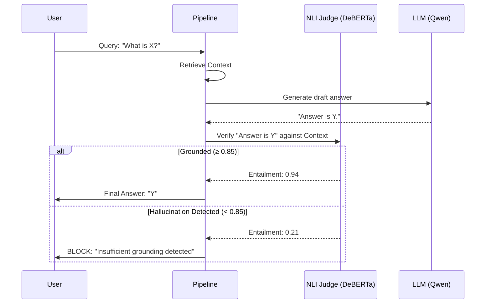
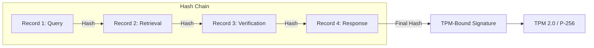

# Sovereign AI Stack: Technical Architecture

The Sovereign AI Stack is a **Research Preview** for a local-first, verify-first RAG pipeline. This document details the architectural principles used to achieve **Verified Grounding** and cryptographic auditability.

## 1. High-Level Architecture

The stack operates as an experimental **Verify-First** pipeline that integrates retrieval, governance, verification, and forensic auditing.

```mermaid
flowchart TD
    A[User Query + Principal] --> B[Hybrid Retriever<br/>BM25 + Dense]
    B --> C[Context Builder]
    C --> D[NLI Grounding Gate<br/>DeBERTa-v3<br/>≥0.85 entailment]
    D -->|Pass| E[LLM Generation<br/>with Citations]
    D -->|Fail| F[Verification Failure<br/>"Insufficient Grounding"]
    E --> G[Signed Audit Event<br/>TPM 2.0 / P-256 Chain]
    F --> G
    G --> H[Forensic Certificate]
```

## 2. The Trinity of Trust (Pipeline)

### 2.1 RETRIEVE (Local RAG)
- Uses a Hybrid Search architecture: **FTS5 (BM25)** for keyword matching + **LanceDB (Vector)** for semantic similarity.
- **BGE-Reranker** cross-encoders refine the top-K results for maximum precision.

### 2.2 GOVERN (ABAC Engine)
- Every request is intercepted by an Attribute-Based Access Control (ABAC) engine.
- Matches Principal attributes (Role, Classification) against Resource attributes (Tenant, Security Level).
- Fail-Closed: If no policy explicitly allows the interaction, it is denied by default.

### 2.3 VERIFY (NLI Grounding Gate)
A dedicated local judge model (DeBERTa-v3 NLI) evaluates the LLM's response against the retrieved evidence. This is an **Alpha feature** and requires domain-specific threshold tuning.



### 2.4 PROVE (Forensic Audit)
- Every event (Request, Retrieval, Decision, Response) is hashed via SHA-256 with canonical JSON serialization.
- **Chaining**: Each record contains the `prev_hash`, creating a cryptographically linked history.
- **Asymmetric Anchoring**: The final state hash is signed using an **TPM-bound P-256 signature** (Windows) or Ed25519 hash chains, providing a hardware root of trust.



## 3. Component Layout

- **`SovereignPipeline`**: The primary facade for developer integration.
- **`SovereignBridge`**: OpenAI-compatible API gateway.
- **`LocalRAG`**: High-performance retrieval engine.
- **`AuditChainManager`**: The cryptographic backend for forensic logging.

## 4. Compliance Framework

The architecture is designed to map directly to:
- **HIPAA Technical Safeguards**: Audit controls (§164.312(b)) and Integrity (§164.312(c)(1)).
- **SOC2 Type II**: Trust Services Criteria (Security, Confidentiality).
- **GAIP-2030**: Principles for trustworthy healthcare AI.

## 5. Performance Specifications

- **Retrieval Latency**: < 5ms (Cached)
- **Verification Overhead**: ~80ms (DeBERTa-v3-base)
- **Throughput**: 30+ RPS (Local M2/M3 or equivalent)
## 6. Security Limitations & Trust Assumptions

As a **Research Preview**, the stack has several known limitations that must be considered:

### 6.1 Trust Assumptions
- **Host OS Integrity**: We assume the host OS (Linux/Windows/macOS) is not compromised at the kernel level.
- **Model Reliability**: The NLI gate is a statistical model. It can be "tricked" by adversarial prompts or subtle semantic shifts.

### 6.2 Implementation Gaps (Roadmap)
- **Hardware Anchoring (TPM 2.0)**: Live support for TPM 2.0 (P-256) is available for Windows. Other platforms fallback to OS Secure Keyring.
- **Formal Verification**: The policy engine (ABAC) is logically sound but has not undergone formal verification or rigorous penetration testing.
- **Model Quantization**: Performance optimizations (4-bit quantization) may introduce subtle grounding errors compared to full-precision baselines.
