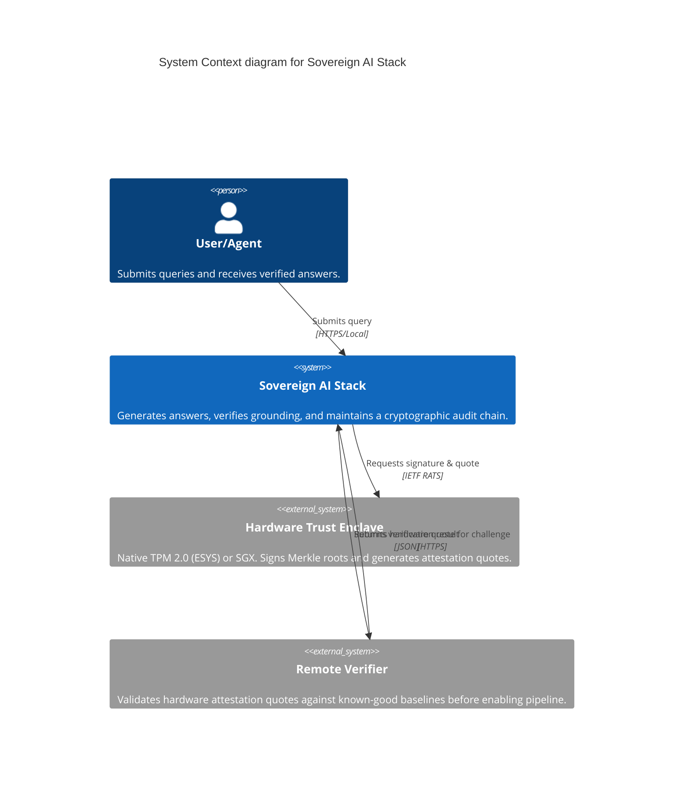

# Architecture & Trust Boundaries

The Sovereign AI Stack is a verified local-first AI system that bridges generative freedom with deterministic security. The architecture enforces zero-trust boundaries at the hardware level, routing all LLM outputs through a cryptographic audit ledger and a Natural Language Inference (NLI) grounding gate.

## C4 Context Diagram

This diagram maps the high-level interactions between the User, the Sovereign AI Pipeline, the Hardware Trust Enclave, and the Remote Verifier.

```mermaid
C4Context
    title System Context diagram for Sovereign AI Stack

    Person(user, "User/Agent", "Submits queries and receives verified answers.")
    System(sovereign_stack, "Sovereign AI Stack", "Generates answers, verifies grounding, and maintains a cryptographic audit chain.")
    System_Ext(hardware_enclave, "Hardware Trust Enclave", "Native TPM 2.0 (ESYS) or SGX. Signs Merkle roots and generates attestation quotes.")
    System_Ext(remote_verifier, "Remote Verifier", "Validates hardware attestation quotes against known-good baselines before enabling pipeline.")

    Rel(user, sovereign_stack, "Submits query", "HTTPS/Local")
    Rel(sovereign_stack, hardware_enclave, "Requests signature & quote", "IETF RATS")
    Rel(sovereign_stack, remote_verifier, "Submits hardware quote for challenge", "HTTPS")
    Rel(remote_verifier, sovereign_stack, "Returns verification result", "JSON")
```

## C4 Container Diagram

This diagram maps the internal components of the Sovereign AI Stack.

```mermaid
C4Container
    title Container diagram for Sovereign AI Stack

    Container_Boundary(pipeline, "Sovereign Pipeline Facade") {
        Container(retriever, "Vector Retriever", "FAISS/Qdrant", "Retrieves context using local embedding models.")
        Container(llm_engine, "LLM Engine", "Ollama/llama.cpp", "Generates candidate answers based on context.")
        Container(nli_gate, "NLI Grounding Gate", "DeBERTa-v3 + Platt Scaling", "Evaluates logical entailment. Enforces strict 0.85 threshold. Fail-closed on contradiction.")
        Container(audit_chain, "Merkle Audit Chain", "Python", "Append-only log. Computes O(1) Merkle proofs. Batches events into cryptographic checkpoints.")
    }

    ContainerDb(sqlite_db, "Metadata Database", "SQLite", "Stores RAG metadata and policies.")
    ContainerDb(audit_log, "Audit Ledger", "JSONL + IDX", "Immutable forensic ledger storing Ed25519-signed events and Merkle roots.")

    Rel(pipeline, retriever, "Queries context")
    Rel(pipeline, llm_engine, "Generates answer")
    Rel(pipeline, nli_gate, "Validates generation")
    Rel(nli_gate, audit_chain, "Logs verification result")
    Rel(audit_chain, audit_log, "Appends signed event & updates index")
```

## Architectural Review: Zero-Trust & Scalability Gaps

In accordance with strict Threat Modeling and DevSecOps principles, the following architectural gaps have been documented:

### 1. Enclave Isolation
**Gap**: Currently, the LLM Engine, NLI Gate, and Audit Chain run in the same memory space as the host OS. While signatures are bound to the TPM, a kernel-level exploit or advanced memory-scraping malware could alter the inputs *before* they are sent to the NLI Gate or the Audit Chain.
**Mitigation Path**: Future versions must move the NLI Gate and Audit Chain directly into Trusted Execution Environments (TEEs) like Intel SGX or AMD SEV-SNP. The LLM can run untrusted, provided its outputs are fed directly into the isolated enclave for verification.

### 2. Scalability of the Cryptographic Ledger
**Gap**: The append-only JSONL log with the `.idx` pointer system provides O(1) seeks, but it is single-node. Under heavy concurrent load, file I/O locks on the JSONL ledger will become a severe bottleneck. 
**Mitigation Path**: Migrate the ledger to an immutable, append-only distributed datastore (e.g., Apache Kafka with signed topics, or an explicitly designed immutable ledger database like Amazon QLDB or DBOS).

### 3. Asymmetric Load on NLI Gate
**Gap**: The LLM Engine is typically GPU-bound and heavily batched, while the NLI Gate relies on strict sequence classification. Currently, the NLI Gate processes validations synchronously via `asyncio.to_thread`. At scale, this thread pool will exhaust system memory or block the event loop.
**Mitigation Path**: Decouple the NLI Gate into an independent gRPC microservice with dedicated GPU partitioning, utilizing Triton Inference Server for dynamic batching of entailment checks.
