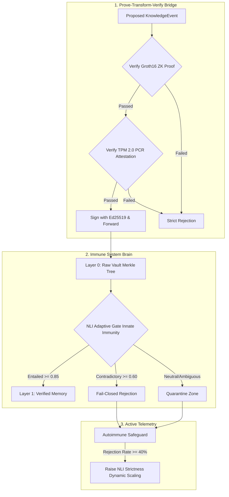

# Technical Brief: The Sovereign AI Stack
**Enforcing Hardware-Anchored, Verify-First Agentic Governance**

*Prepared for the Info-communications Media Development Authority (IMDA) of Singapore & AI Verify Foundation*  
*Target Date: Technical Briefing Q3 2026*

---

## Executive Summary

As autonomous agentic AI architectures shift from human-in-the-loop workflows to fully agent-driven operational environments, securing the integrity and sovereignty of organizational knowledge becomes critical. Traditional guardrails (e.g., system prompt enforcement, vector database overrides) fail at the boundary of complex reasoning, making systems vulnerable to knowledge injection and poisoning attacks.

The **Sovereign AI Stack** introduces the **Immune System Brain**, a verify-first, fail-closed, fully sovereign agentic memory framework. By coupling hardware-attested identity with zero-knowledge proofs and adaptive Natural Language Inference (NLI), the system guarantees that only authorized, policy-compliant knowledge is committed to memory. This technical brief describes the integration of the **Prove-Transform-Verify (PTV) protocol** and the **Immune System Brain** as a reference architecture aligned with the Singapore Model AI Governance Framework.

---

## Key Architectural Synergy: PTV & Immune System Brain

The Sovereign AI Stack constructs an "airlock" for organizational knowledge. The relationship between the decentralized **PTV protocol** and the **Immune System Brain** forms a complete cryptographic and logic-based defense loop:

### 1. The PTV Bridge (Hardware-Anchored Verification)
Before any `KnowledgeEvent` is evaluated for content safety, the **PTV Bridge** enforces cryptographic compliance:
*   **Zero-Knowledge Proofs (Groth16):** Verifies that the recommending agent evaluated policies under a verified execution runtime (~187ms generation, <5ms verification) without exposing private operational credentials.
*   **Hardware Attestation (TPM 2.0):** Validates the host system's hardware configuration (PCR quotes) to prevent impersonation or execution on compromised virtualization layers.

### 2. The NLI Adaptive Gate (Logical Immunity)
Once identity and integrity are mathematically proven, the **NLI Adaptive Gate** evaluates the payload's semantic relationship to existing memory using a local, sovereign Cross-Encoder (DeBERTa-v3):
*   **Entailed (Accept):** Smoothly merged into Layer 1 (Verified Layer).
*   **Contradictory (Reject):** Strictly dropped (Fail-Closed) to prevent memory poisoning.
*   **Neutral (Quarantine):** Placed in the Quarantine Zone for out-of-band resolution to prevent subtle, incremental drift.

---

## Alignment with Singapore Model AI Governance Framework & AI Verify

The Sovereign AI Stack is designed to directly satisfy the foundational pillars of the **Model AI Governance Framework (2nd Edition)** and **AI Verify** testing methodologies:

| Framework Principle | Technical Realization in Sovereign AI Stack | AI Verify Audit Alignment |
| :--- | :--- | :--- |
| **Transparency & Explainability** | Every proposed memory change undergoes local NLI grounding, producing explicit probability scores for Entailment, Contradiction, and Neutral states. | Audit logs record precise scoring metrics and decision thresholds for every transaction, eliminating "black box" decisions. |
| **Security & Resilience** | The **Autoimmune Safeguard** monitors recent rejections. Under a coordinated attack (e.g., rejection rate $\ge 40\%$), the system dynamically increases NLI strictness to shield core memory. | Validates resilience under continuous adversarial simulation (knowledge poisoning attacks) without downtime. |
| **Accountability** | All transactions are hashed and chained into an immutable Merkle tree (Layer 0 Vault) and signed using hardware-bound Ed25519 keys. | Non-repudiable forensic ledger provides a mathematically verifiable audit trail back to the physical TPM 2.0 chip. |
| **Sovereignty & Privacy** | The entire validation loop (TPM, Groth16 verification, DeBERTa-v3 inference, and local Merkle storage) runs fully offline on local metal. | Ensures zero outbound data leaks, complying with sovereign privacy directives. |

---

## Technical Performance & Governance Metrics

*   **ZKP Verification Latency:** $<5\text{ ms}$ (highly scalable for high-frequency operations).
*   **NLI Decision Latency:** $15-30\text{ ms}$ (locally optimized cross-encoder).
*   **Fail-Closed State:** 100% of unverified or un-attested packets are rejected at the PTV Bridge before reaching semantic evaluation.
*   **Dynamic Response Window:** 10-event sliding telemetry window continuously evaluates and dynamically scales thresholds to self-insulate against attacks.

---

## Next Steps for Q3 2026 IMDA Briefing
1.  **AI Verify Sandbox Integration:** Map the `Layer 0 Vault` schema to AI Verify's reporting dashboard formats.
2.  **Physical TPM 2.0 Demonstration:** Showcase physical TPM key binding using local Linux/Windows hardware attestation modules.
3.  **Governance Collaborative Testing:** Engage IMDA evaluation teams for simulated multi-agent knowledge injection stress testing.
