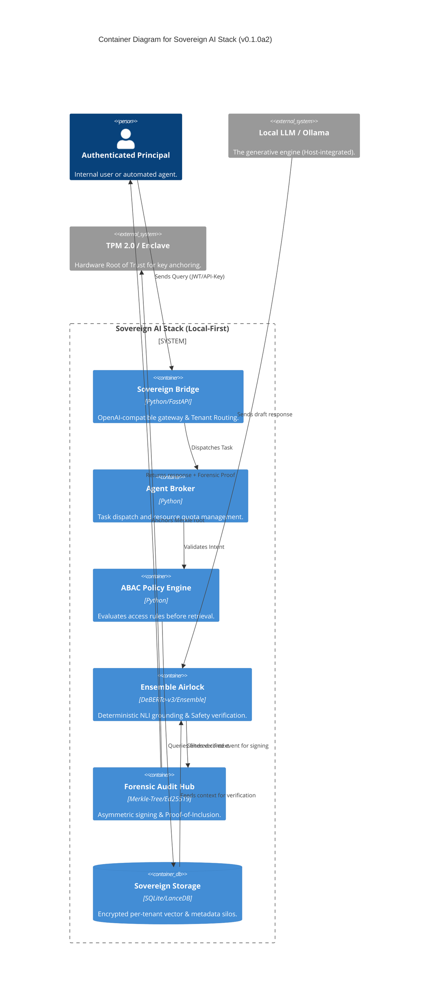

# C4 Container Diagram: Sovereign AI Stack (v0.1.0a2)

> [!NOTE]
> **Orchestration Note**: In the current Alpha state, `pipeline.py` orchestrates the flow between containers 1–4. The target refactor is to move this into a decoupled `ForensicMiddleware` chain in Phase 6.

### 🛡️ Layered Sovereignty Matrix

| Layer | Component | Architect Value |
| :--- | :--- | :--- |
| **Layer 1: Interaction** | **Sovereign Bridge** | Prevents cross-principal data leakage at the entry point. |
| **Layer 2: Governance** | **ABAC Engine** | Ensures data is never leaked into the prompt context illegally. |
| **Layer 3: Verification** | **Ensemble Airlock** | Mitigates the "Black Box" failure mode of probabilistic LLMs. |
| **Layer 4: Forensics** | **Audit Hub** | Provides immutable evidence for regulatory compliance. |
